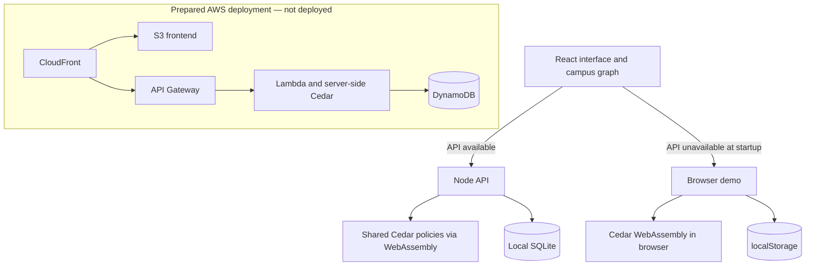

# clearpath.

### Campus access, kept open.

ClearPath connects a reported accessibility barrier, the people fixing it, and the route someone needs today. A repair stays off the route until an independent demonstration role verifies it. The result is one visible loop: **report → repair → verify → reopen the path**.

Built for [First Commit 2026](https://www.wemakedevs.org/aws/first-commit), with React, an original illustrated campus interface, and the real Cedar authorization engine.

**[Open the live browser demo](https://clearpath-campus.vercel.app)** — hosted on Vercel, with the real AWS open-source Cedar engine running as WebAssembly in your browser and localStorage persistence. This live URL does not have a deployed cloud API.

**[Browse the public source](https://github.com/krishnatayal1410/clearpath-campus).** The local Node/SQLite application builds and all **nine automated tests pass**. The route-changing verification flow was checked in Brave against the local connected API. The Vercel site returns HTTP 200; browser workflow verification of that public deployment remains pending. AWS infrastructure is prepared but has not been deployed. This is prepared for **Build It** using Cedar; it does not claim Ship It status. The required YouTube video and event submission remain pending. See the [delivery checkpoint](docs/STATUS.md).

> Greenfield Campus, its map, distances, people, reports and repairs are fictional demonstration data. Use sample information only. This application does not send maintenance requests to a real institution or provide real-world navigation guidance.

## Why this exists

An accessible entrance on a map can become unusable when a door fails or a ramp is blocked. Students need current information, and facilities staff need a report they can own and resolve. UGC's guidance specifically covers campus mapping, mobility maintenance and grievance handling. ClearPath demonstrates how those activities can share one operational record. Read the [research and competitive context](docs/RESEARCH.md).

## What works

- **Barrier reports:** create a report against a connected campus path; search, filter, support and inspect existing reports.
- **A complete repair lifecycle:** move from reported to in progress, record a repair note, await independent verification, and resolve or reopen a report.
- **Routes that respond:** Dijkstra's algorithm avoids unresolved non-lighting barriers and, in step-free mode, paths with steps. It handles unavailable routes and identical start/end points.
- **Real authorization:** shared Cedar policies run in the Node API and browser sandbox. The API independently evaluates permissions and denies cross-workspace actions, forbidden roles and self-verification.
- **Persistent workspaces:** the connected API uses SQLite, opaque role-scoped session tokens and conditional revisions. A separate browser demo uses localStorage when the API is unavailable at startup.
- **Usable detail:** keyboard focus and map controls, written route information, responsive layouts, activity history, repair notes and JSON workspace export.

## Run it locally

Use **Node.js 22.13 or newer** and npm. Node's built-in SQLite may print an experimental-feature warning on some supported releases.

```sh
npm ci
```

Start the API in one terminal:

```sh
npm run server
```

Start the development interface in a second terminal:

```sh
npm run dev
```

Open [ClearPath on localhost:5173](http://localhost:5173) in Brave. Vite proxies `/api` to the API on [localhost:8787](http://localhost:8787). The UI identifies whether it is using a **Connected workspace** or **Browser demo**. Start the backend before opening the page to use server persistence.

For a single local server serving the compiled application:

```sh
npm run build
npm run server
```

Then open [localhost:8787](http://localhost:8787). SQLite data is stored in `.data/clearpath.sqlite`. The API supports `PORT`, `HOST` and `DATABASE_PATH`; its default host is `127.0.0.1`. See [API and authorization details](docs/API.md).

## See the difference in one minute

In a fresh sample workspace:

1. Open **Find a clear path**. Choose **North Gate → Central Library**, leave step-free routing enabled and calculate the route. The seeded detour is **745 m**.
2. Switch the top-bar demonstration role to **Access champion**. Open **North entrance door needs adjustment** (`CP-1040`), which is awaiting verification.
3. Enter a fictional verification note of at least 12 characters, such as “Demo check: the entrance now opens freely.” Choose **Verify & reopen path**.
4. Calculate the same journey again. The reopened direct path is **120 m**. Inspect the activity history to see the transition.

These are distances in the sample graph, not measured benefits for real students. For the entire lifecycle, start a reported issue as **Facilities**, record the repair, then switch to **Access champion** for verification. Recording a repair alone keeps its segment blocked.

## Architecture



The domain transitions, campus graph and policies are shared across runtimes. The API derives principals from stored opaque sessions; it does not accept a client-provided role as authority. Switching a demo role rotates its token. Optimistic concurrency prevents a stale update from silently overwriting another change.

The CloudFormation templates in `infra/` and the scripts in `scripts/` prepare Lambda, API Gateway, DynamoDB, S3 and CloudFront deployment. They require an authenticated AWS account and create billable resources. Their presence is not proof of a live deployment. SQLite is for the local server; the Lambda adapter uses DynamoDB.

## Validation and limitations

```sh
npm test
npm run build
```

The nine tests exercise real Cedar schema validation and denials, repair-to-route behavior, step-free and disconnected routes, invalid transitions and stale writes, reopening, verification evidence, session isolation and token rotation, and conditional SQLite revisions. A successful build and these tests do not establish live cloud availability or accessibility certification. The local connected route was verified in Brave: resolving `CP-1040` changed the seeded 745 m route to 120 m. The Vercel deployment still needs equivalent browser workflow verification.

The role switch is intentionally available to explore the demo; it is **not production staff identity verification**. Browser storage is editable by its user, and browser-only policy checks are not a security boundary. API workspaces isolate demonstrations, not verified campus organizations. Authentication, real campus surveys, community moderation and testing with disabled students and facilities teams remain future work. The UI's fonts load from Google Fonts with local fallbacks.

## Project notes

- [API and authorization](docs/API.md)
- [Research and scope](docs/RESEARCH.md)
- [Submission preparation](docs/SUBMISSION.md)
- [Demo recording script](docs/DEMO-SCRIPT.md)
- [Credits and dependency licences](docs/CREDITS.md)

Prepared as a solo entry for Krishna Tayal, **primarily implemented by OpenAI Codex using GPT-6**. Codex performed research, code generation, design iteration, tests and documentation under the user's instruction. This does not claim unaided manual coding, review or learning by the entrant. The project does not train or contain a new proprietary language model. Original project code is provided under the [MIT License](LICENSE), copyright Krishna Tayal, 2026. Dependencies, icons and fonts retain their own licences.
