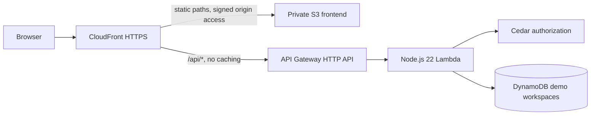

# ClearPath deployment

ClearPath is a campus accessibility service-request prototype. Its AWS deployment runs the built React frontend behind CloudFront and a private S3 bucket, and runs the API in Lambda with DynamoDB persistence. The Lambda API evaluates Cedar policies on the server before applying state changes.

**Current release status:** the public preview at [clearpath-campus.vercel.app](https://clearpath-campus.vercel.app) is a browser-only demonstration. It is not evidence that the AWS backend is deployed, and it must not be described as a completed AWS “Ship It” deployment. The AWS templates and Lambda package have been validated locally; live AWS provisioning and live DynamoDB behavior remain unverified until an authenticated account is available and the deployment succeeds. See the deployment receipt produced by the script for actual CloudFront and API URLs.

## Architecture



The API uses HTTP API payload format 2.0 and `server/lambda.handler`. Production dependencies are copied into the ZIP with the Cedar WebAssembly files intact. Lambda uses the same `src/domain.mjs`, `src/policy.mjs`, and `server/service.mjs` as the local API. Local development persists to SQLite; AWS persists to DynamoDB. The frontend and `/api/*` are served from the same CloudFront domain, with API caching disabled and the viewer's `Host` header removed before forwarding to API Gateway. SPA rewriting is attached only to static navigation, so API failures remain API failures.

## Prerequisites

- Node.js 22, npm, Bash, `zip`, and `curl`.
- AWS CLI v2 with a valid signed session, for example an IAM Identity Center profile. Use an existing approved identity; do not put access keys in source files.
- An AWS account with permission to deploy CloudFormation stacks and the listed S3, CloudFront, API Gateway v2, Lambda, DynamoDB, CloudWatch Logs, and IAM role resources. The deployer needs `iam:PassRole` for the Lambda execution role. The runtime role itself only receives `dynamodb:GetItem`, `PutItem`, and `DeleteItem` on this stack's table and log-write access to its own log group.
- A deployment region supporting these resources. The script defaults to `us-east-1`; set `AWS_REGION` to select another supported region.
- Account access to the chosen services and sufficient service quotas. Template validation cannot prove account permissions, service eligibility, or regional quotas.

For an existing CLI profile, verify it without exposing secrets:

```bash
export AWS_PROFILE=your-existing-profile
export AWS_REGION=us-east-1
aws sts get-caller-identity
aws lambda get-account-settings
```

AWS requires at least 100 units of account concurrency to remain unreserved. The template therefore defaults `LambdaReservedConcurrency` to `-1`, meaning no per-function reservation. This avoids the common first-deployment failure on accounts with small Lambda quotas. To impose a maximum of 5 concurrent executions where the account has sufficient headroom, set `CLEARPATH_LAMBDA_CONCURRENCY=5` before deployment. A value of `0` intentionally disables invocation; it is not a default. [AWS reserved concurrency documentation](https://docs.aws.amazon.com/lambda/latest/api/API_PutFunctionConcurrency.html).

## Build, validate, and deploy

Run commands from the repository root:

```bash
npm ci
npm test
npm run build
bash scripts/package-lambda.sh
```

The package script makes a clean `work/lambda-package/`, installs from the exact lockfile with development dependencies omitted, imports the Lambda handler to catch missing modules/WASM, and creates `work/clearpath-lambda.zip`. It prints the ZIP size and SHA-256. It does not contact AWS or create infrastructure. Build artifacts and local databases must remain excluded from Git.

For independent template and shell checks:

```bash
python3 -m venv work/cfn-tools
work/cfn-tools/bin/python -m pip install 'cfn-lint>=1,<2'
work/cfn-tools/bin/cfn-lint infra/template.yaml infra/bootstrap.yaml
bash -n scripts/package-lambda.sh scripts/deploy-aws.sh scripts/smoke-live.sh
```

The checked-in GitHub Actions workflow runs tests, the frontend build, Lambda packaging/import, template schema validation, and shell syntax checks. It does not contain cloud credentials or deploy resources automatically. Local schema validation does not substitute for a real CloudFormation change set or post-deployment testing.

To create or update the AWS deployment:

```bash
export AWS_REGION=us-east-1
export CLEARPATH_STACK=clearpath-demo
bash scripts/deploy-aws.sh
```

The script performs a signed identity check, clean install, tests, and build before changing infrastructure. It then:

1. Validates both templates using the AWS API.
2. Creates or updates a separate private artifact-bucket stack.
3. Uploads the Lambda ZIP under `clearpath/<sha256>.zip`.
4. Deploys the application template, including its scoped runtime IAM role.
5. Uploads hashed frontend assets before `index.html`, preserving assets still used by open tabs.
6. Invalidates the shell, waits for the CloudFront distribution to deploy, and runs a read-only live smoke check.

The local file `work/deployment-outputs.json` records `SiteUrl`, `ApiUrl`, `DistributionId`, `WebBucketName`, and `WorkspaceTableName`. Use its `SiteUrl` as the AWS demo link only after the live checks pass. Never infer a deployment URL or mark a submission complete from template/build success alone.

## Verify the actual AWS release

```bash
bash scripts/smoke-live.sh https://your-distribution.cloudfront.net
```

The read-only script verifies that the built frontend shell is reachable and `/api/health` returns success. A healthy AWS API should identify `storage: "dynamodb"` and Cedar `4.13.0`. A browser-only preview has no working AWS health endpoint and is not expected to pass this check. The health endpoint exercises DynamoDB access, but it does not prove the full user journey.

Complete these browser checks against the resulting CloudFront URL:

1. Start a fresh sample student workspace and verify its identity is marked as a demo.
2. Create an accessibility issue and reload. Confirm it persists.
3. Try a facilities-only transition as the student. Verify it is denied and state is unchanged.
4. Switch to the sample facilities role, assign the issue, start work, and mark the repair complete.
5. Switch to the sample verifier, verify the repair, and confirm the route changes only after verification.
6. Open a separate browser profile/private session. Confirm it starts an isolated workspace and cannot retrieve the first workspace's state.
7. Test the main journey on a mobile viewport, keyboard navigation, and a fresh tab opened directly on a non-API app route.
8. Confirm browser console/network errors are absent during the successful flow. Keep screenshots and the exact URLs/commit as submission evidence.

API clients create a session with `POST /api/session` and receive a random bearer token. Authenticated requests use `Authorization: Bearer <token>`. `POST /api/role` rotates that token and deletes the old session token. Keep these ephemeral tokens out of public logs, screenshots, and submissions.

## Data retention and prototype boundaries

- The named users, campus map, and initial reports are synthetic. Role switching deliberately lets a judge experience different permissions. It is not production login, campus enrollment, or proof of a person's identity.
- DynamoDB stores workspaces under `PK=WORKSPACE#<id>, SK=STATE`, and hashed-token sessions under `PK=SESSION#<hash>, SK=SESSION`. Only token hashes are persisted. Mutations use conditional revision checks to prevent silent lost updates.
- `DEMO_TTL_HOURS` defaults to 24 and is clamped to 1–72. The API rejects expired sessions/workspaces. DynamoDB TTL is also enabled on numeric `expiresAt`, but physical deletion is asynchronous and may take days. Expired records can still incur storage charges until removed. [AWS TTL behavior](https://docs.aws.amazon.com/amazondynamodb/latest/developerguide/TTL.html).
- Workspace state is capped at 300,000 JSON bytes, and the domain caps reports at 250. These are per-workspace controls, not a global account storage cap. A public user can create additional workspaces; anonymous-session abuse remains a production gap.
- Logs expire after 7 days. API access logs record request ID, route, status, and latency rather than request bodies or bearer tokens.
- The Lambda runtime has no permission to read other tables, S3 assets, secrets, or AWS accounts. It has no managed administrative policies.
- The direct API Gateway URL remains publicly reachable and enforces the same token/Cedar checks. CloudFront is not an authentication boundary.
- The content security policy permits same-origin scripts/API calls, Cedar WebAssembly compilation, Google Fonts, and HTTPS images. New external integrations need a deliberate CSP review.
- Before real campus use, replace role selection with verified institution identity and server-assigned roles; add abuse protection, a durable tenant enrollment policy, monitoring/alerts, recovery/backup plans, an appropriate retention policy, and accessibility testing with affected users. No claim of real-world safety certification or emergency-response readiness is made.

## Costs and limits

This architecture avoids always-on application instances and NAT gateways, but it is not guaranteed free. Charges can include CloudFront requests/data transfer, S3 storage/requests, HTTP API requests, Lambda invocations/duration, DynamoDB storage/request units, and CloudWatch logs. Free-tier eligibility and promotional credits depend on the account and current AWS terms. Check the [AWS pricing calculator](https://calculator.aws/) for the chosen region and expected use, along with [API Gateway](https://aws.amazon.com/api-gateway/pricing/), [Lambda](https://aws.amazon.com/lambda/pricing/), and [DynamoDB](https://aws.amazon.com/dynamodb/pricing/) pricing.

The prototype sets an HTTP API target rate of 5 requests/second with burst 10. The DynamoDB table caps on-demand throughput at 200 read units/second and 512 write units/second; the write cap is intentionally above the maximum size of one workspace write. Larger workspaces consume multiple request units per operation and can be throttled under concurrent activity. Lambda has 512 MB memory and a 15-second timeout, with an optional concurrency cap as described above. These settings limit throughput, not cumulative spend. AWS API throttling is best-effort and can return 429 responses; it is not a billing ceiling. [API throttling](https://docs.aws.amazon.com/apigateway/latest/developerguide/http-api-throttling.html), [DynamoDB throughput caps](https://docs.aws.amazon.com/amazondynamodb/latest/developerguide/on-demand-capacity-mode-max-throughput.html).

Review account billing and configure an account-level budget alert before leaving an unrestricted public demo running. Alerts notify; they do not automatically stop this stack. No paid model provider or Bedrock invocation is required by this application.

## Updates, rollback, and cleanup

Redeploy the same stack name to update. Lambda artifacts use content-addressed object keys so changed code produces a CloudFormation update. The artifact bucket expires packages after 30 days; to redeploy an older commit after that window, rebuild and upload its package. Frontend `index.html` revalidates while hashed assets are cached for a year. Old noncurrent S3 object versions expire after 7 days.

Both S3 buckets and the DynamoDB table use `DeletionPolicy: Retain` and `UpdateReplacePolicy: Retain`. This prevents accidental data loss during stack changes but means deleting the stacks alone does not remove every chargeable resource. Before cleanup, record the three retained resource names from the stack outputs, archive any needed evidence, and explicitly decide whether to delete the synthetic workspace data, artifact versions, and static object versions. Stop public traffic by disabling/removing the CloudFront distribution and API through the stack lifecycle. Then remove retained resources separately if no longer needed; versioned S3 buckets require removal of object versions and delete markers as well as current objects. No destructive cleanup script runs automatically.

If deployment fails, inspect the actual CloudFormation failure and its resource-specific reason. Do not classify a local build or a different hosting preview as successful AWS deployment. Account sign-in, billing/service access, missing IAM permissions, and service quotas require account-side resolution before this release can be verified.
